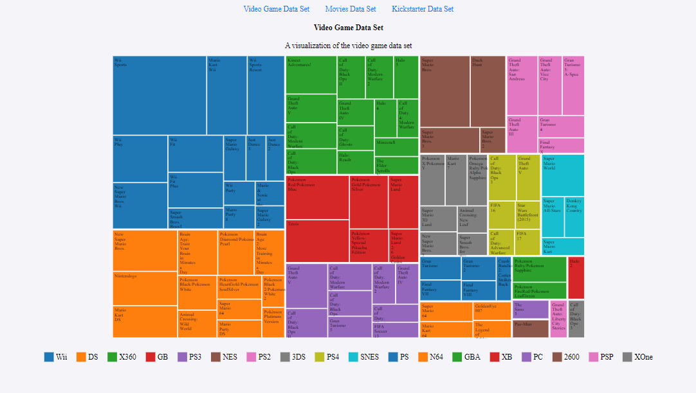

# visualize-data-with-a-treemap-diagram
                                                                                                                                      

## Project Description

This project is a treemap diagram that visualizes the Video Game, Movies and Kickstarter Data Sets The application is built using HTML, CSS, and JavaScript, using the D3.js library for creating the diagram and visualizing the data.

## Project Setup

To set up the project locally, follow these steps:

1. Clone the repository to your local machine using:
   ```bash
   git clone https://github.com/your-username/visualize-data-with-a-treemap-diagram

[the live site](https://moezltifi.github.io/visualize-data-with-a-treemap-diagram)

